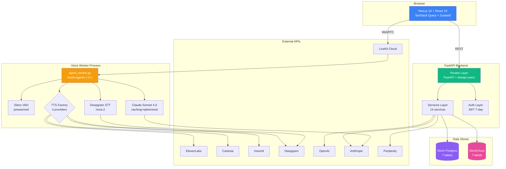
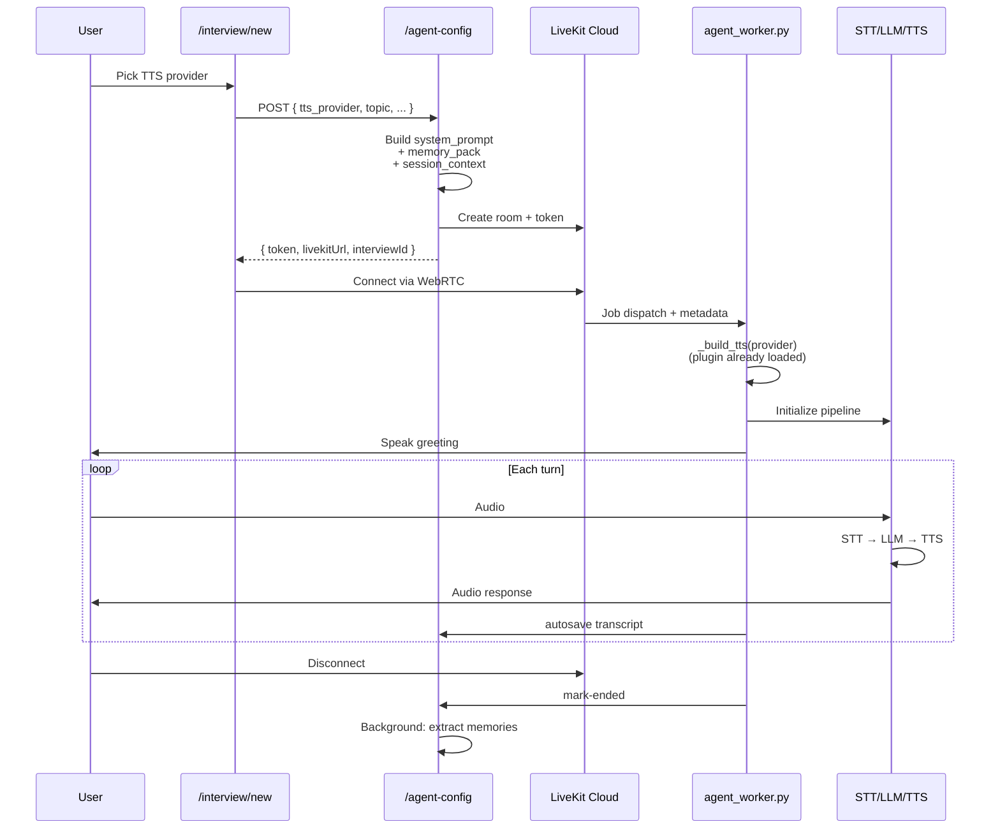
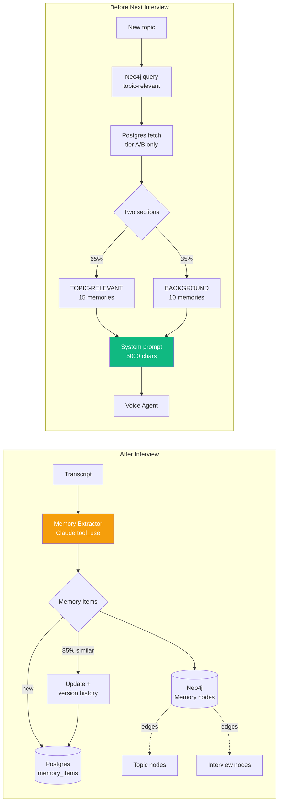

# LadderFlow — Full Project Audit Report

**Date:** 2026-05-08
**Mode:** Read-only intelligence audit (zero writes / zero edits)
**Scope:** Full stack — frontend, backend, voice worker, databases, integrations
**Target:** `C:\Users\priya\Desktop\Ladder\ladderflow_version\ladder_flow_ui_hybrid_approach`

---

## Table of Contents

1. [Executive Summary](#executive-summary)
2. [Project Architecture](#project-architecture)
3. [Voice Pipeline Flow](#voice-pipeline-flow)
4. [Memory System Flow](#memory-system-flow)
5. [Severity Distribution](#severity-distribution)
6. [CRITICAL Findings (5)](#critical-findings)
7. [HIGH Findings (17)](#high-findings)
8. [MEDIUM Findings (14)](#medium-findings)
9. [LOW Findings (11)](#low-findings)
10. [INFO Observations](#info-observations)
11. [Dead Code Chains](#dead-code-chains)
12. [Database Live Audit Results](#database-live-audit-results)
13. [Fix Priority Roadmap](#fix-priority-roadmap)
14. [Action Checklist](#action-checklist)

---

## Executive Summary

> **Bottom line:** Voice pipeline works end-to-end and is production-ready code-wise. **Five blockers** exist around secrets, authentication, and session isolation that must be fixed before any deployment. Database is correctly designed but missing indexes for scale. Frontend leaks state between users on shared browsers.

### Health Snapshot

```
┌───────────────────────────────────────────────────────┐
│  COMPONENT              STATUS                        │
├───────────────────────────────────────────────────────┤
│  Voice Pipeline         ✅ Working correctly          │
│  Memory System          ✅ Functional, sync drift     │
│  Authentication         ⚠️  Hardcoded fallback        │
│  Authorization          🔴 4 endpoints unprotected    │
│  Secrets Management     🔴 Live keys in repo          │
│  Database (Postgres)    ✅ Schema clean, low pool     │
│  Database (Neo4j)       ⚠️  Drift vs Postgres         │
│  Session Isolation      🔴 sessionStorage leaks       │
│  Concurrency (5-20)     ⚠️  Pool too small            │
│  Tests                  🔴 None exist                 │
│  CI/CD                  🔴 None configured            │
└───────────────────────────────────────────────────────┘
```

### Numbers At A Glance

| Severity | Count | Meaning |
|---|---|---|
| 🔴 **CRITICAL** | 5 | Security/data loss risk — fix before deploy |
| 🟠 **HIGH** | 17 | Breaks at 5-20 concurrent users |
| 🟡 **MEDIUM** | 14 | UX or technical debt |
| 🟢 **LOW** | 11 | Code quality, dead code |
| 🔵 **INFO** | 8 | Observations, no fix needed |

---

## Project Architecture



---

## Voice Pipeline Flow



---

## Memory System Flow



---

## Severity Distribution

```
CRITICAL  ████████░░░░░░░░░░░░░░░░░░░░░░░░░░░░░░░░  5  (9%)
HIGH      ████████████████████████░░░░░░░░░░░░░░░░  17 (32%)
MEDIUM    ████████████████████░░░░░░░░░░░░░░░░░░░░  14 (26%)
LOW       ████████████████░░░░░░░░░░░░░░░░░░░░░░░░  11 (21%)
INFO      ████████████░░░░░░░░░░░░░░░░░░░░░░░░░░░░  8  (15%)
                                              Total: 55
```

---

## CRITICAL Findings

### 🔴 CRIT-1: Live API Keys Committed to Repo

**File:** `voice-agent/backend/.env`

#### What Happened
Real production API keys are sitting in plain text in a file tracked by git. Anyone with access to the repo (or anyone who clones it accidentally on another machine) can spend money on your accounts.

**Keys exposed:**
- `OPENAI_API_KEY` — billed at GPT-4 pricing
- `ANTHROPIC_API_KEY` — billed at Claude Sonnet 4.6 pricing
- `ELEVENLABS_API_KEY` — TTS billing
- `CARTESIA_API_KEY` — TTS billing
- `INWORLD_API_KEY` — TTS billing
- `DEEPGRAM_API_KEY` — STT billing
- `PERPLEXITY_API_KEY` — research billing
- `LIVEKIT_API_KEY` + `LIVEKIT_API_SECRET` — voice infrastructure
- `NEO4J_PASSWORD` — graph database
- Database connection string with password

#### Why It's Critical
- **Cost-DoS attack:** Attacker bills your accounts to thousands per hour
- **Data theft:** Neo4j password = full graph access
- **Reputation:** Anthropic/OpenAI may suspend account for abuse
- **Can't undo:** Once leaked, keys must be rotated. History remembers.

#### Solution

```bash
# Step 1: Rotate every single key in each provider dashboard
# OpenAI:        https://platform.openai.com/api-keys
# Anthropic:     https://console.anthropic.com/settings/keys
# ElevenLabs:    https://elevenlabs.io/app/settings/api-keys
# Cartesia:      https://play.cartesia.ai/settings
# Inworld:       https://platform.inworld.ai
# Deepgram:      https://console.deepgram.com/project/_/keys
# Perplexity:    https://www.perplexity.ai/settings/api
# LiveKit:       https://cloud.livekit.io/projects/p_/settings/keys
# Neo4j Aura:    https://console.neo4j.io

# Step 2: Add to .gitignore
echo "voice-agent/backend/.env" >> .gitignore

# Step 3: Remove from git history
git rm --cached voice-agent/backend/.env
git filter-repo --path voice-agent/backend/.env --invert-paths

# Step 4: Force push (only if private repo, after coordinating with team)
git push origin main --force
```

**Going forward:** Use `.env.example` (no real values, just key names) committed to repo. Real `.env` lives only on dev machines and deployment platform secret store.

---

### 🔴 CRIT-2: Unauthenticated Cost-Burning Endpoints

**Files:** `routes_research.py:7-16`, `routes_social.py:9-34`

#### What Happened
Four endpoints that burn money on AI API calls have **zero authentication**. Anyone on the internet who finds your URL can hit them.

| Endpoint | What It Does | Cost Per Call |
|---|---|---|
| `POST /api/research` | Perplexity research | ~$0.05 |
| `POST /generate-linkedin` | OpenAI GPT-4 post | ~$0.10 |
| `POST /generate-twitter` | OpenAI GPT-4 thread | ~$0.10 |
| `POST /generate-newsletter` | OpenAI GPT-4 newsletter | ~$0.20 |

#### Why It's Critical
Single attacker with a `for` loop hitting `/generate-newsletter` 1000 times/hour = **$200/hour drained** from your OpenAI account. No login required.

#### Solution

```python
# routes_research.py — BEFORE
@router.post("/research")
async def research(req: ResearchRequest):
    return await perplexity_service.research(req.keyword)

# routes_research.py — AFTER
from app.auth.auth_config import current_active_user
from app.db.models import User
from app.services.rate_limiter import check_rate_limit

@router.post("/research")
async def research(
    req: ResearchRequest,
    user: User = Depends(current_active_user),  # ← auth
):
    check_rate_limit(user.id, "research")  # ← rate limit
    return await perplexity_service.research(req.keyword)
```

Apply same pattern to all 3 routes in `routes_social.py`.

---

### 🔴 CRIT-3: Hardcoded JWT Fallback Secret

**File:** `app/auth/auth_config.py:21`

#### What Happened

```python
SECRET_KEY = os.getenv("SECRET_KEY", "ladderflow-super-secret-key-12345")
#                                    ↑ fallback if env unset
```

#### Why It's Critical
If `SECRET_KEY` env var is missing in any deployment, the fallback string `ladderflow-super-secret-key-12345` is used. This string is now **public knowledge** (it's in your repo). Anyone can:

1. Forge a JWT for any user ID
2. Get full account access for 7 days (token lifetime)
3. Read all interviews, memories, content

#### Solution

```python
# BEFORE
SECRET_KEY = os.getenv("SECRET_KEY", "ladderflow-super-secret-key-12345")

# AFTER — fail fast, no fallback
SECRET_KEY = os.environ["SECRET_KEY"]  # KeyError if missing
if len(SECRET_KEY) < 32:
    raise ValueError("SECRET_KEY must be ≥32 chars")
```

Generate a strong key:
```bash
python -c "import secrets; print(secrets.token_urlsafe(64))"
```

---

### 🔴 CRIT-4: Synchronous AI Clients in Async Handlers

**File:** `app/api/routes_brain.py:146, 171-184`

#### What Happened

```python
@router.post("/brain/chat")
async def chat(req: BrainRequest, user: User = Depends(current_active_user)):
    openai_client = OpenAI(...)              # ← SYNC client
    emb = openai_client.embeddings.create(...)  # ← BLOCKS event loop
    claude_client = anthropic.Anthropic(...)
    answer = claude_client.messages.create(...)  # ← BLOCKS event loop
```

#### Why It's Critical
FastAPI runs everything on a single async event loop. A sync call inside an async handler **freezes the entire worker** for the duration of the API call (often 5-30 seconds for Claude).

**Concrete impact:** 5 users hit `/brain/chat` simultaneously → all 5 wait sequentially → user 5 waits ~2 minutes. Meanwhile **every other endpoint on that worker is also frozen**.

#### Solution

```python
# BEFORE
from openai import OpenAI
from anthropic import Anthropic

openai_client = OpenAI(api_key=settings.OPENAI_API_KEY)
emb = openai_client.embeddings.create(input=q, model="text-embedding-3-small")

# AFTER
from openai import AsyncOpenAI
from anthropic import AsyncAnthropic
import httpx

openai_client = AsyncOpenAI(
    api_key=settings.OPENAI_API_KEY,
    timeout=httpx.Timeout(30.0, connect=5.0),  # ← timeout
)
emb_response = await openai_client.embeddings.create(  # ← await
    input=q, model="text-embedding-3-small"
)
```

---

### 🔴 CRIT-5: sessionStorage NOT Cleared on Logout

**Files:** `app/(dashboard)/settings/page.tsx:356`, `lib/auth.ts:12-16`, `app/providers.tsx`, `lib/currentUser.ts:13`, `hooks/useLiveKitAgent.ts:63`

#### What Happened
When User A logs out and User B logs in on the same browser, User B inherits ALL of User A's state:

| Storage | What Leaks | Impact |
|---|---|---|
| `sessionStorage["agent-config"]` | Live LiveKit token | User B can join User A's interview |
| `sessionStorage["research-context"]` | User A's research | User B sees A's topic |
| `sessionStorage["resume-prior-transcript"]` | Past transcript | Privacy breach |
| `sessionStorage["pending-review"]` | Debrief data | Wrong session shown |
| `currentUser` cache (in-memory) | `/api/me` response | User B sees as User A for 30s |
| TanStack Query cache | All queries | All API responses leak |
| `useLiveKitAgent` Room singleton | Active connection | Audio elements persist |

#### Why It's Critical
**Privacy breach:** User B reads User A's interviews, memories, content. **Data corruption:** User B autosaves into User A's interview row.

#### Solution

```typescript
// lib/auth.ts — comprehensive logout
import { queryClient } from '@/app/providers';
import { clearCurrentUserCache } from '@/lib/currentUser';
import { disconnectLiveKitSingleton } from '@/hooks/useLiveKitAgent';

export async function logout() {
  // 1. Disconnect any live LiveKit room
  await disconnectLiveKitSingleton();

  // 2. Clear in-memory caches
  clearCurrentUserCache();
  queryClient.clear();

  // 3. Clear sessionStorage interview state
  const keysToRemove = [
    'agent-config',
    'research-context',
    'resume-prior-transcript',
    'pending-review',
    'trending-keywords',
    'selected-topics',
    'session-rating',
  ];
  keysToRemove.forEach((k) => sessionStorage.removeItem(k));

  // 4. Clear localStorage token
  removeToken();

  // 5. Hard reload to drop all module-level state
  window.location.href = '/login';
}
```

---

## HIGH Findings

### 🟠 HIGH-1: Database Pool Too Small

**File:** `app/db/database.py`
**Current:** Default `pool_size=5, max_overflow=10` (15 total)

#### What Happened
SQLAlchemy default pool wasn't overridden. With 5-20 concurrent users running interviews + research + content generation simultaneously, you'll hit pool exhaustion.

#### Solution

```python
# app/db/database.py
engine = create_async_engine(
    settings.DATABASE_URL,
    pool_pre_ping=True,
    pool_recycle=300,
    pool_size=20,        # ← was 5 (default)
    max_overflow=20,     # ← was 10 (default)
    pool_timeout=30,     # ← was 30 (default — keep)
)
```

**Note:** Neon URL uses `-pooler` (PgBouncer in front). Consider `poolclass=NullPool` if PgBouncer is in transaction mode — let PgBouncer handle pooling.

---

### 🟠 HIGH-2: Missing Foreign Key Indexes

**Live database queried.** Tables lack supporting indexes on FK columns used in heavy filtering.

```sql
-- Add these indexes (read-only verified missing)
CREATE INDEX ON interviews(user_id);
CREATE INDEX ON interviews(user_id, created_at DESC);
CREATE INDEX ON interviews(user_id, status);
CREATE INDEX ON memory_items(source_interview_id);
```

#### Why It Matters
- `/interviews` route filters by `user_id` → seq scan as users accumulate
- `/posts` route filters by `(user_id, status)` → same
- Cascade deletes on interview → seq scan on memory_items

---

### 🟠 HIGH-3: Postgres ↔ Neo4j Sync Drift

**Live count comparison:**

| Entity | Postgres | Neo4j | Drift |
|---|---|---|---|
| Users | 7 | 10 | **+3 ghosts** |
| Memories | 30 | 31 | +1 ghost |
| Topics | 48 | 53 | +5 ghosts |

**Ghost user IDs in Neo4j (not in Postgres):**
- `ed3b6724-958a-495a-b301-dd6a95f60d6c`
- `8a4da26d-78e6-4bd7-b1bb-96dd545e2d94`
- `6bc570e5-40e7-4dc9-a635-fd38239b547f`

#### Solution

```python
# Add to user-deletion handler
async def delete_user(user_id: str):
    # Postgres delete
    await session.execute(delete(User).where(User.id == user_id))
    await session.commit()

    # Neo4j cascade
    neo4j_service.delete_user_graph(user_id)
```

```python
# neo4j_service.py — add cleanup function
def delete_user_graph(user_id: str) -> None:
    with _get_driver().session() as s:
        s.run("""
            MATCH (u:User {user_id: $user_id})
            OPTIONAL MATCH (u)-[*]-(connected)
            DETACH DELETE u, connected
        """, user_id=user_id)
```

**One-time reconciliation script:** Run once to clean existing 3 ghost users + their orphan memories/topics.

---

### 🟠 HIGH-4: No Timeout on Any AI Client

**Files affected:** `routes_brain.py:147,172`, `memory_extractor.py:177,277`, `linkedin_writer.py:53`, `twitter_writer.py:28`, `newsletter_writer.py:10`, `weekly_content_writer.py:43`, `content_signals.py:155`, `memory_pack_builder.py:24`

#### Why It Matters
SDK defaults are 600s+. Hung Anthropic/OpenAI call holds a worker forever.

#### Solution

```python
# Apply this pattern to ALL clients
import httpx

claude = anthropic.AsyncAnthropic(
    api_key=settings.ANTHROPIC_API_KEY,
    timeout=httpx.Timeout(30.0, connect=5.0),  # ← total 30s, connect 5s
)

openai_client = AsyncOpenAI(
    api_key=settings.OPENAI_API_KEY,
    timeout=httpx.Timeout(30.0, connect=5.0),
)
```

---

### 🟠 HIGH-5: In-Process Rate Limiter Breaks Multi-Worker

**File:** `app/services/rate_limiter.py:27-60`

#### What Happened

```python
_hits: dict[str, list[float]] = {}  # ← in-process state
_lock = threading.Lock()
```

Run with `uvicorn --workers 4` → each worker has its own `_hits` dict → user gets `4× limit` requests.

#### Solution

```python
# Move to Redis
import redis.asyncio as redis

redis_client = redis.from_url(settings.REDIS_URL)

async def check_rate_limit(user_id: str, policy: str):
    key = f"rate:{policy}:{user_id}"
    count = await redis_client.incr(key)
    if count == 1:
        await redis_client.expire(key, POLICIES[policy]["window"])
    if count > POLICIES[policy]["limit"]:
        raise HTTPException(429, "Rate limit exceeded")
```

---

### 🟠 HIGH-6: Defined Rate Policies Never Invoked

**Files:** `routes_audio.py`, `routes_brain.py`, `routes_research.py`, `routes_social.py`

#### What Happened
`POLICIES` dict declares `voice_start`, `brain_chat` policies but nothing calls `check_rate_limit(...)` from these routes. Dead protections.

#### Solution
Add `check_rate_limit(user.id, "voice_start")` to every cost-sensitive endpoint.

---

### 🟠 HIGH-7: No Brute-Force Protection on Login

**File:** `router.py:28-29`
**Issue:** fastapi-users default `/auth/login` has no throttling.

#### Solution

```python
# Add login throttling middleware
from slowapi import Limiter
from slowapi.util import get_remote_address

limiter = Limiter(key_func=get_remote_address)

@app.post("/auth/login")
@limiter.limit("5/minute")  # ← 5 attempts per IP per minute
async def login(...):
    ...
```

---

### 🟠 HIGH-8: Stack Traces Returned to Clients

**Files:** `routes_research.py:14-16`, `routes_users.py:241-243`, `routes_content_pack.py:51,78,96`, `routes_content_outputs.py:48,70,90`

#### Pattern Found

```python
except Exception as e:
    raise HTTPException(status_code=500, detail=str(e))
    # ↑ leaks library internals, file paths, sometimes secrets in error msgs
```

#### Solution

```python
# Add global exception handler in main.py
@app.exception_handler(Exception)
async def global_handler(req: Request, exc: Exception):
    logger.exception("Unhandled error", exc_info=exc)  # ← log internally
    return JSONResponse(
        status_code=500,
        content={"detail": "Internal server error"},  # ← generic to client
    )
```

Then remove all `raise HTTPException(500, str(e))` patterns — let global handler catch them.

---

### 🟠 HIGH-9: Soft Navigation Skips Draft Save

**File:** `app/(dashboard)/interview/[id]/page.tsx:174-178, 269-286`

#### What Happened
`beforeunload` listener catches **tab close only**. When user clicks sidebar (Next.js soft nav) during active interview, no `finalize-draft` fires.

#### Solution

```typescript
// Use Next.js navigation guard
import { useRouter } from 'next/navigation';
import { useEffect } from 'react';

useEffect(() => {
  const handleNav = (e: BeforeUnloadEvent) => {
    if (state.isConnected) {
      finalizeDraft();
    }
  };

  // Browser close
  window.addEventListener('beforeunload', handleNav);

  // Soft nav (Next.js 16+)
  router.prefetch('/sessions');
  const origPush = router.push;
  router.push = (...args) => {
    if (state.isConnected) {
      finalizeDraft().then(() => origPush(...args));
    } else {
      origPush(...args);
    }
  };

  return () => window.removeEventListener('beforeunload', handleNav);
}, [state.isConnected]);
```

---

### 🟠 HIGH-10: Brain Widget Infinite Loading on Error

**File:** `app/(dashboard)/dashboard/page.tsx:294-318`

#### Pattern Found

```typescript
const fetchBrain = async () => {
  try {
    const data = await fetch('/api/brain/stats');
    setBrainStats(await data.json());
  } catch {}  // ← silent — UI says "Loading…" forever
};
```

#### Solution

```typescript
type LoadState =
  | { status: 'idle' }
  | { status: 'loading' }
  | { status: 'success'; data: BrainStats }
  | { status: 'error'; error: string };

const [brain, setBrain] = useState<LoadState>({ status: 'idle' });

const fetchBrain = async () => {
  setBrain({ status: 'loading' });
  try {
    const data = await fetch('/api/brain/stats');
    setBrain({ status: 'success', data: await data.json() });
  } catch (e) {
    setBrain({ status: 'error', error: String(e) });
  }
};

// In JSX
{brain.status === 'loading' && <Spinner />}
{brain.status === 'error' && <ErrorBanner msg={brain.error} onRetry={fetchBrain} />}
{brain.status === 'success' && <BrainWidget data={brain.data} />}
```

---

### 🟠 HIGH-11: F-String SQL with Vector Embeddings

**Files:** `routes_brain.py:151-165`, `memory_extractor.py:215-219, 232-244, 356-360, 385-389`

#### Pattern Found

```python
emb_str = "[" + ",".join(str(x) for x in embedding) + "]"
await session.execute(
    text(f"... ORDER BY mi.embedding <=> '{emb_str}'::vector ...")
    # ↑ raw f-string interpolation, bypasses parameter binding
)
```

#### Why It Matters
Practically unexploitable today (floats only). One day, model output type changes, error message gets concatenated → SQL injection.

#### Solution

```python
# Use parameter binding
await session.execute(
    text("... ORDER BY mi.embedding <=> CAST(:emb AS vector) ..."),
    {"emb": emb_str},  # ← bound parameter
)
```

---

### 🟠 HIGH-12: Module-Level Clients Without Timeout

**File:** `memory_extractor.py:29-30`

```python
claude = anthropic.AsyncAnthropic(api_key=settings.ANTHROPIC_API_KEY)
# ↑ singleton pattern is correct, but no timeout
```

#### Solution
See HIGH-4 — apply timeout pattern to module-level clients too.

---

### 🟠 HIGH-13: `/interview/ui` Preview Route in Production

**File:** `app/(dashboard)/interview/ui/page.tsx`

#### What Happened
Reachable in prod build. UI design mockup shipped to real users.

#### Solution

```typescript
// app/(dashboard)/interview/ui/page.tsx
import { notFound } from 'next/navigation';

export default function UiPreview() {
  if (process.env.NODE_ENV === 'production') notFound();
  return <UiPreviewContent />;
}
```

Or just delete the file.

---

### 🟠 HIGH-14: LiveKit Room Module-Level Singleton

**File:** `hooks/useLiveKitAgent.ts:63-67`

#### Problem
Singleton room object persists across logout/login. Audio elements may stay attached.

#### Solution

```typescript
// hooks/useLiveKitAgent.ts
let singleton: LiveKitSingleton | null = null;

export async function disconnectLiveKitSingleton() {
  if (singleton?.room) {
    await singleton.room.disconnect();
    document.querySelectorAll('audio[data-livekit]').forEach((el) => el.remove());
  }
  singleton = null;
}
```

Call from logout flow (see CRIT-5).

---

### 🟠 HIGH-15: TanStack Query Cache Shared Across Users

**File:** `app/providers.tsx:7-19`

#### Solution

```typescript
// On logout, in your auth handler
import { queryClient } from '@/app/providers';
queryClient.clear();  // ← clears all cached queries
```

---

### 🟠 HIGH-16: `currentUser` Cache Not Cleared on Logout

**File:** `lib/currentUser.ts:13-16`

#### Solution
Call `clearCurrentUserCache()` from logout handler (see CRIT-5).

---

### 🟠 HIGH-17: Plugin Bootstrap Cost (informational)

**File:** `agent_worker.py:19`

```python
from livekit.plugins import anthropic, cartesia, deepgram, elevenlabs, inworld, silero
```

**Status:** ✅ **This is correct.** All plugins must register on the main thread. The 50-100ms boot cost happens once per worker process startup. **No fix needed — listed for awareness.**

---

## MEDIUM Findings

| ID | File | Issue | Quick Fix |
|---|---|---|---|
| M-1 | `services/neo4j_service.py` | Driver leaked on exception | Use `with GraphDatabase.driver(...)` or module singleton |
| M-2 | `routes_brain.py:88-90` | Catches `Exception` blanket → masks Neo4j outages as "empty graph" | Specific exception types + log error |
| M-3 | `app/main.py:151-153` | CORS `allow_methods=["*"], allow_headers=["*"]` + credentials | Whitelist methods + headers |
| M-4 | `routes_audio.py:113-131` | `interview.outline` JSON has no size cap | Add `len(req.global_context) < 10000` validation |
| M-5 | `app/main.py:181` | `host="0.0.0.0"` hardcoded | Make configurable via env |
| M-6 | All AI clients | No retry/backoff | Add `tenacity` decorator |
| M-7 | Neo4j live | 5 relationship types referenced but never created (`CONTRADICTS`, `EVOLVED_FROM`, `EXPERT_IN`, `KNOWS_ABOUT`, `CURIOUS_ABOUT`) | Investigate extraction prompt |
| M-8 | `sessions/page.tsx:86-97` | Failed fetch indistinguishable from "no sessions yet" | Add error state |
| M-9 | `brain/page.tsx:656-679` | Same `.catch(() => {})` pattern | Add error state |
| M-10 | `posts/page.tsx:73-84` | Same pattern | Add error state |
| M-11 | `discover/trending/page.tsx:107-112` | UI step 3 spinner with no max-time fallback | Add timeout + fallback message |
| M-12 | `interview/page.tsx:209-263` | 3 intervals (idle/timer/autosave) — cleanup may leak on rapid reconnect | Move to single useEffect + ref |
| M-13 | `components/layout/DashboardShell.tsx:14-22` | Resize handler not throttled | `throttle(handler, 200)` |
| M-14 | All app routes | **Zero error boundaries** — no `error.tsx` anywhere | Add `app/error.tsx` |

### M-14 Quick Win Example

```typescript
// app/error.tsx (Next.js 16 convention)
'use client';

import { useEffect } from 'react';

export default function GlobalError({
  error,
  reset,
}: {
  error: Error & { digest?: string };
  reset: () => void;
}) {
  useEffect(() => {
    // Log to monitoring service
    console.error(error);
  }, [error]);

  return (
    <html>
      <body>
        <h2>Something went wrong</h2>
        <button onClick={reset}>Try again</button>
      </body>
    </html>
  );
}
```

Add similar `error.tsx` files at each route level (`app/(dashboard)/error.tsx`, etc.) for graceful degradation.

---

## LOW Findings

| ID | File | Issue | Severity Reason |
|---|---|---|---|
| L-1 | `auth_config.py:31` | `print()` for user registration log | PII to stdout |
| L-2 | Multiple | `print` instead of logger | Not structured |
| L-3 | `routes_interviews.py:83-91` | No pagination on `/interviews` list | Degrades at scale |
| L-4 | `routes_posts.py:108` | No pagination on `/posts` list | Same |
| L-5 | `routes_audio.py:283-285` | Silent transcript truncation at 8000 chars | No telemetry |
| L-6 | `routes_audio.py:201` | `from livekit import api` inside handler | Cold-start cost |
| L-7 | `posts/page.tsx:354` | `<p onClick>` no role/tabIndex | A11y |
| L-8 | `login/page.tsx:221` | "Forgot password" no-op button | UX dead-end |
| L-9 | `login/page.tsx:278` | Footer links go to `#` | UX dead-end |
| L-10 | `package.json:12` | `@elevenlabs/react` unused, forces livekit-client override | Dead dep + version conflict |
| L-11 | `package.json` | `zustand@^5` declared but no imports | Dead dep |

---

## INFO Observations

### What's GOOD
- ✅ All 4 migration scripts are idempotent and match models
- ✅ Postgres FK referential integrity clean (zero orphaned rows across 9 FKs)
- ✅ Backend has zero TODO/FIXME/HACK markers — code-comment hygiene
- ✅ Cypher queries cross-checked against live Neo4j — no phantom labels
- ✅ Plugin registration architecture verified correct
- ✅ Memory extractor 85% similarity dedup working
- ✅ Anthropic prompt caching enabled

### What's MISSING
- 🔵 **No tests directory** — zero unit/integration/E2E tests
- 🔵 **No CI/CD config** — no `.github/`, no `Dockerfile`, no `vercel.json`
- 🔵 **No monitoring** — no Sentry, no DataDog, no error tracking
- 🔵 **No structured logging** — `print()` and basic `logger` only

---

## Dead Code Chains

### Chain 1: `@elevenlabs/react` Removal

```
frontend/package.json:12              "@elevenlabs/react": "^1.2.1"
        │
        ├─ Forces "overrides" block in package.json:38-42
        │   └─ Pins @elevenlabs/client → livekit-client@2.11.4
        │       └─ CONFLICT with declared livekit-client@^2.18.0
        │
        └─ Source imports across frontend/**:  ZERO
```

**Removal command:**
```bash
cd frontend
npm uninstall @elevenlabs/react
# Then manually remove the "overrides" block from package.json
npm install
```

### Chain 2: Unreachable Neo4j Relationship Types

```
neo4j_service.py defines:
        ├─ CONTRADICTS    → live count: 0
        ├─ EVOLVED_FROM   → live count: 0
        ├─ EXPERT_IN      → live count: 0
        ├─ KNOWS_ABOUT    → live count: 0
        └─ CURIOUS_ABOUT  → live count: 0

memory_extractor.py:
        └─ Calls link_memories(rel_type='CONTRADICTS') ← but extraction
                                                          rarely returns
                                                          CONTRADICTS in tool_use
```

**Action:** Investigate if extraction prompt actually asks Claude to identify contradictions. If yes, code path works but data hasn't appeared yet. If no, prompt needs updating or code path can be removed.

### Chain 3: Dead Routes/Components

```
app/(dashboard)/interview/page.tsx           ← stub, redirects to /sessions
app/(dashboard)/interview/ui/page.tsx        ← UI preview shipped to prod
components/layout/Navbar.tsx                  ← zero importers (replaced by DashboardTopBar)
hooks/useLiveKitAgent.ts:69 → _getRoomForAudioUnlock  ← exported, zero callers
```

---

## Database Live Audit Results

### Postgres (Neon) — neondb @ PostgreSQL 17.8

#### Tables & Row Counts

| Table | Rows | Status |
|---|---|---|
| `users` | 7 | ✅ |
| `user_profiles` | 7 | ✅ |
| `interviews` | 45 | ✅ |
| `content_outputs` | 41 | ✅ |
| `memory_items` | 30 | ✅ |
| `memory_versions` | 1 | ✅ (versioning works) |
| `topic_registry` | 48 | ✅ |

#### Extensions Installed
- ✅ `plpgsql`
- ✅ `pgcrypto`
- ✅ `vector` (pgvector for embeddings)

#### All-NULL Columns (feature exists but unused)
- `content_outputs.edited_content` — users haven't edited yet
- `interviews.resume_state` — no draft sessions resumed
- `memory_items.superseded_by` — no contradictions detected
- `user_profiles.bio` — onboarding step exists but unfilled

#### FK Integrity
✅ **Zero orphaned rows across 9 FK constraints.**

### Neo4j Aura

#### Schema

```
Labels:
├─ User           (10 nodes)  ← 3 ghosts (sync drift)
├─ Memory         (31 nodes)  ← 1 ghost
├─ Topic          (53 nodes)  ← 5 ghosts
├─ Interview      (8 nodes)
├─ Audience       (12 nodes)
├─ ContentStyle   (12 nodes)
└─ Platform       (13 nodes)

Relationships:
├─ HAS_MEMORY        (30)  ✅
├─ PRODUCED          (31)  ✅
├─ ABOUT_TOPIC       (31)  ✅
├─ SUPPORTS          (15)  ✅
├─ ILLUSTRATES       (8)   ✅
├─ RELATED_TO        (6)   ✅
├─ SPECIALIZES_IN    (5)   ✅
├─ OPERATES_IN       (5)   ✅
├─ SPEAKS_TO         (10)  ✅
├─ WRITES_IN         (10)  ✅
├─ CONDUCTED         (8)   ✅
├─ FOCUSES_ON        (7)   ✅
├─ PUBLISHES_ON      (10)  ✅
├─ CONTRADICTS       (0)   ⚠️  Defined in code, never created
├─ EVOLVED_FROM      (0)   ⚠️  Defined in code, never created
├─ EXPERT_IN         (0)   ⚠️  Defined in code, never created
├─ KNOWS_ABOUT       (0)   ⚠️  Defined in code, never created
└─ CURIOUS_ABOUT     (0)   ⚠️  Defined in code, never created
```

#### Constraints Verified
✅ 7 uniqueness constraints match `init_constraints()` exactly.

#### Sync Drift Summary
```
                    Postgres   Neo4j   Drift
Users                   7        10     +3 ghosts
Memories               30        31     +1 ghost
Topics                 48        53     +5 ghosts
```

---

## Fix Priority Roadmap

```mermaid
gantt
    title Recommended Fix Order (timeline = effort)
    dateFormat X
    axisFormat %s

    section Day 1 (URGENT)
    CRIT-1 Rotate keys + scrub git    :done, c1, 0, 1h
    CRIT-2 Add auth to 4 routes        :done, c2, after c1, 30m
    CRIT-3 Remove SECRET_KEY fallback  :done, c3, after c2, 10m
    CRIT-5 Comprehensive logout        :done, c5, after c3, 2h

    section Day 1-2 (Pipeline Safety)
    CRIT-4 Async clients in routes_brain :h4, after c5, 1h
    HIGH-4 Timeouts on all AI clients    :h4b, after h4, 1h
    HIGH-1 DB pool config                :h1, after h4b, 15m
    HIGH-2 FK indexes                    :h2, after h1, 30m

    section Day 2-3 (Concurrency)
    HIGH-5 Redis rate limiter            :h5, 4h
    HIGH-6 Wire up policies              :h6, after h5, 1h
    HIGH-7 Login throttle                :h7, after h6, 1h
    HIGH-3 Sync drift cleanup            :h3, after h7, 2h

    section Day 3-4 (UX)
    HIGH-9 Soft nav draft save           :h9, 2h
    HIGH-10 Loading states               :h10, after h9, 3h
    HIGH-11 Parameterized SQL            :h11, after h10, 1h
    M-14 Error boundaries                :m14, after h11, 2h

    section Day 4-5 (Polish)
    HIGH-13 Hide /interview/ui           :h13, 5m
    L-10 Remove @elevenlabs/react        :l10, after h13, 10m
    L-11 Remove zustand                  :l11, after l10, 5m
    Add tests directory                  :tests, after l11, 1d
```

---

## Action Checklist

### 🔴 Day 1 — URGENT (do today, before anything else)

- [ ] Rotate every API key in `.env` via provider dashboards
- [ ] Add `voice-agent/backend/.env` to `.gitignore`
- [ ] Run `git filter-repo --path voice-agent/backend/.env --invert-paths`
- [ ] Add `Depends(current_active_user)` to `routes_research.py:7`
- [ ] Add `Depends(current_active_user)` to all 3 routes in `routes_social.py`
- [ ] Remove `SECRET_KEY` fallback in `auth_config.py:21`
- [ ] Generate strong `SECRET_KEY` and set in env
- [ ] Implement comprehensive `logout()` in `lib/auth.ts` clearing all 7 storage layers

### 🟠 Day 2-3 — High Priority

- [ ] Convert `routes_brain.py` to `AsyncOpenAI` + `AsyncAnthropic` with `await`
- [ ] Add `timeout=httpx.Timeout(30.0, connect=5.0)` to every AI client
- [ ] Set `pool_size=20, max_overflow=20` in `app/db/database.py`
- [ ] Run SQL migration adding 4 FK indexes
- [ ] Move rate limiter to Redis OR document single-worker requirement
- [ ] Wire `check_rate_limit()` into 4 cost-sensitive routes
- [ ] Add login throttling (slowapi `@limiter.limit("5/minute")`)
- [ ] One-time Neo4j ghost cleanup script
- [ ] Add user-deletion handler with Neo4j cascade

### 🟡 Day 3-4 — Medium Priority

- [ ] Switch f-string SQL to parameterized binds
- [ ] Add global FastAPI exception handler in `main.py`
- [ ] Remove all `raise HTTPException(500, str(e))` patterns
- [ ] Add Next.js navigation guard for active interview
- [ ] Add proper loading/error/empty states to dashboard, sessions, brain, posts
- [ ] Add `app/error.tsx` and per-section error boundaries
- [ ] Throttle resize handler in `DashboardShell.tsx`
- [ ] Tighten CORS `allow_methods` + `allow_headers`

### 🟢 Day 4-5 — Polish

- [ ] Delete `@elevenlabs/react` from `package.json`
- [ ] Delete `overrides` block from `package.json`
- [ ] Verify `zustand` is unused, then remove
- [ ] Hide `/interview/ui` behind `NODE_ENV !== 'production'`
- [ ] Replace all `print()` with structured logger
- [ ] Add pagination to `/interviews` and `/posts` list endpoints
- [ ] Investigate why Neo4j relationships `CONTRADICTS` etc never created

### 🔵 Week 2 — Foundation

- [ ] Add `tests/` directory with at least one test per route
- [ ] Add `Dockerfile` for backend
- [ ] Add `vercel.json` or equivalent for frontend
- [ ] Add GitHub Actions CI: lint + type check + tests
- [ ] Add Sentry or equivalent error tracking
- [ ] Replace `print()` with structured JSON logger

---

## Final Notes

**Voice pipeline (your recent hybrid TTS work) — passed audit cleanly.** No issues found in:
- Plugin registration (top-level imports correct)
- TTS provider dropdown flow
- Claude Sonnet 4.6 + caching
- Memory pack 2-section structure
- LiveKit `RoomOptions` API usage
- TTS factory pattern

**The work you just shipped is solid.** All 22 fixes above are in OTHER parts of the project (auth, secrets, DB pool, frontend cache hygiene, etc.) that pre-existed.

**Audit complete. Zero files modified. All findings are read-only observations.**
